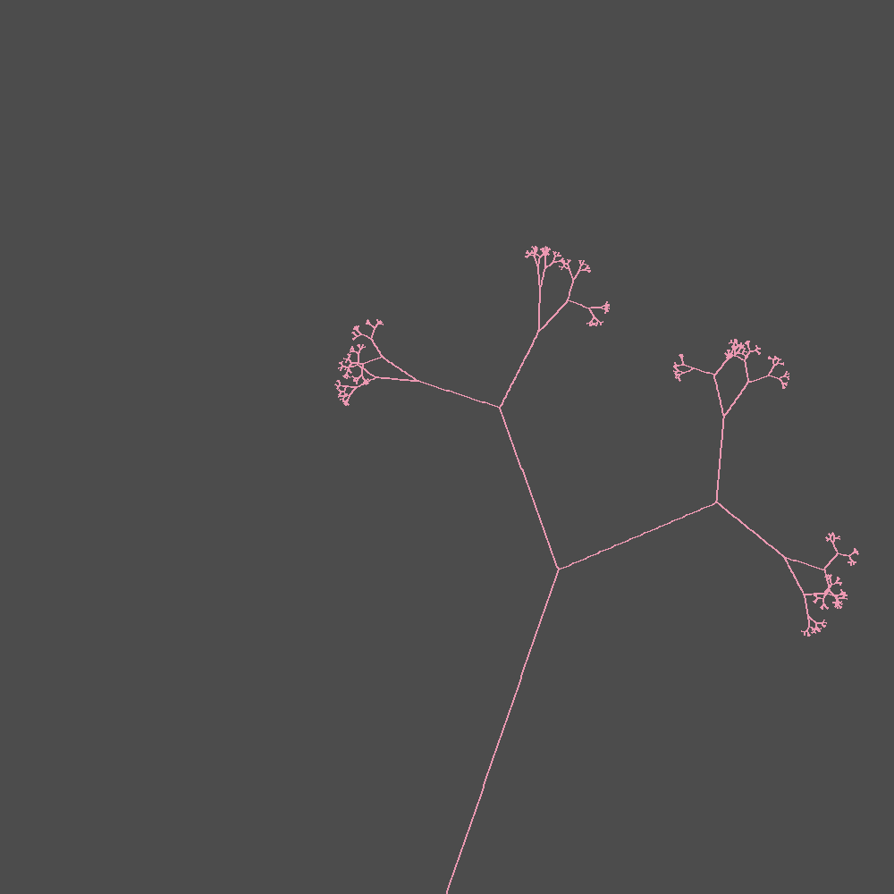
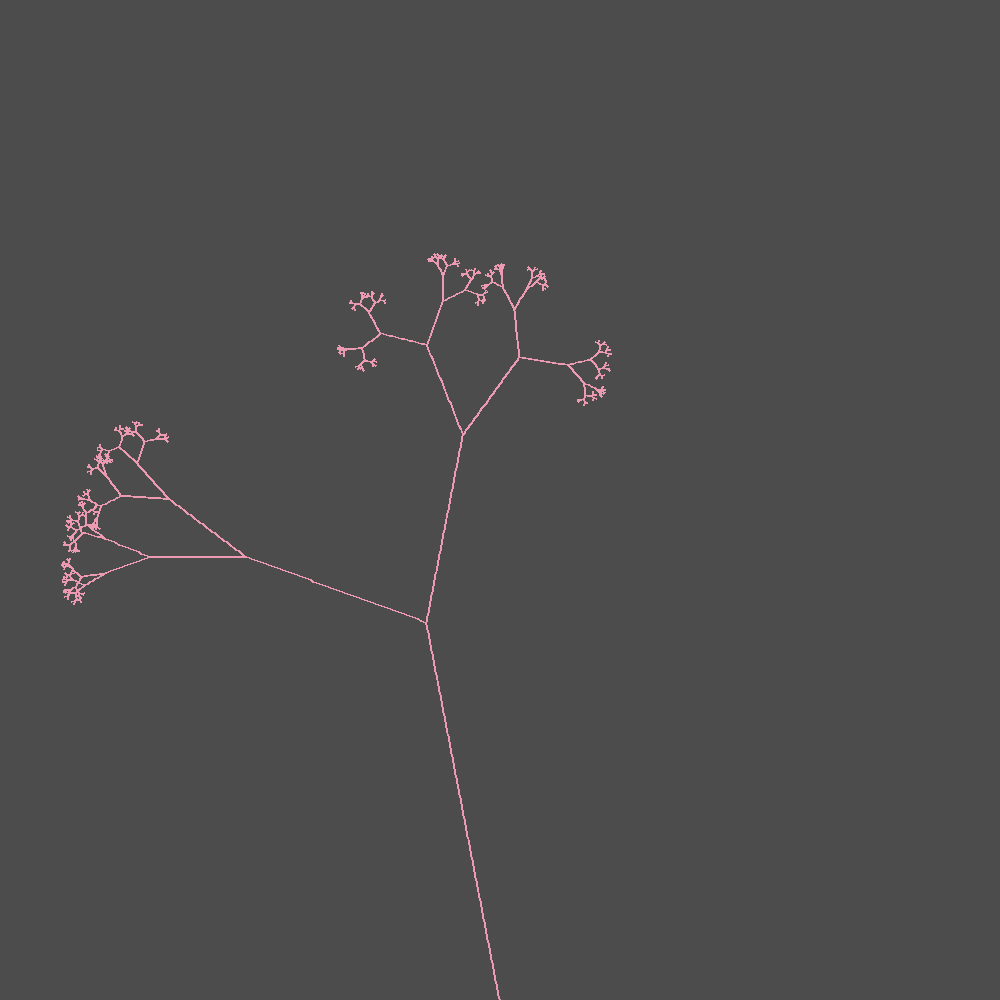
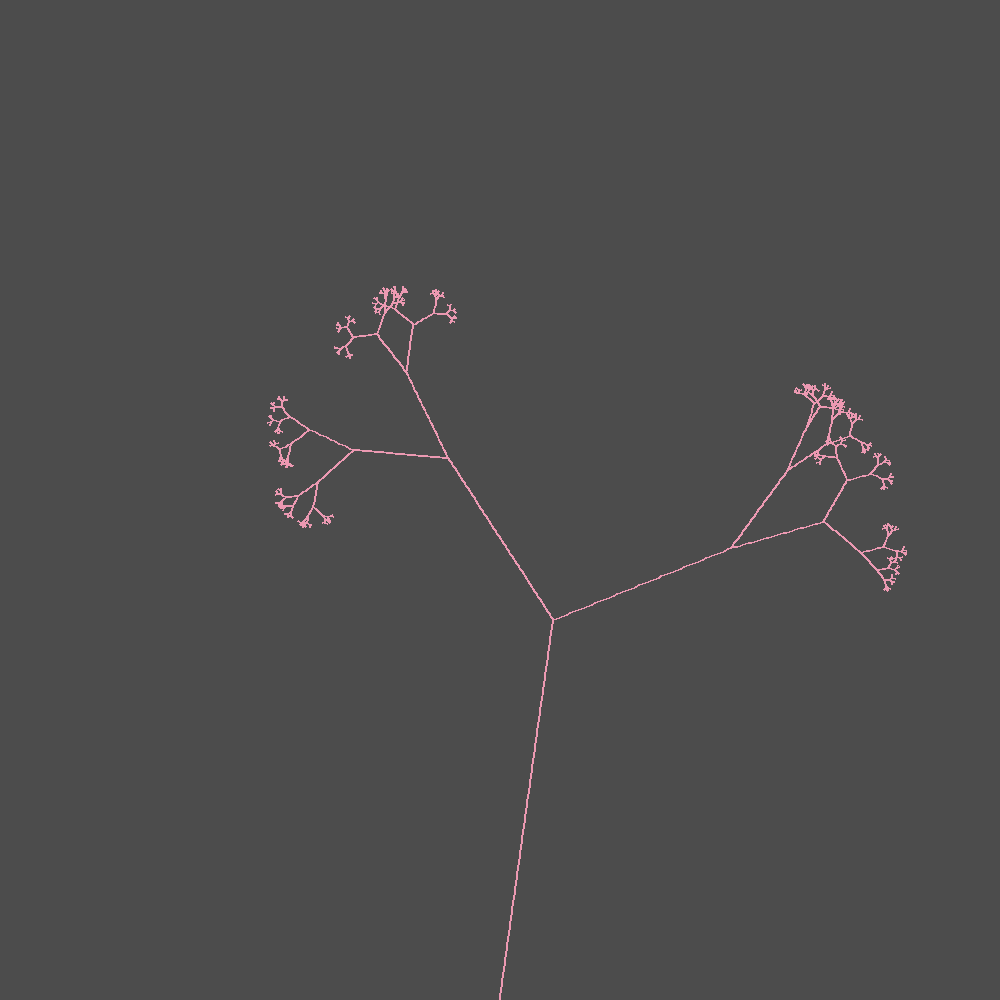

# Advanced Python programming with L-systems 

  
  
  

We will be learning how to code in python by implementing [Lindenmayer systems](https://en.wikipedia.org/wiki/L-system).

According to Wikipedia:

> An L-system or Lindenmayer system is a parallel rewriting system and a type of formal grammar. An L-system consists of an alphabet of symbols that can be used to make strings, a collection of production rules that expand each symbol into some larger string of symbols, an initial "axiom" string from which to begin construction, and a mechanism for translating the generated strings into geometric structures.

We will cover:
* Modules
* Classes
* Functions
* Object oriented programming
* Test driven development
* Commandline arguments

# Add to this document!
Feel free to keep adding to this document, perhaps with your own observations or results from experiments :)